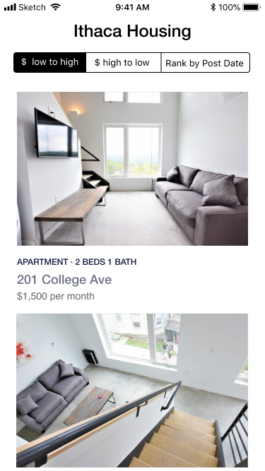
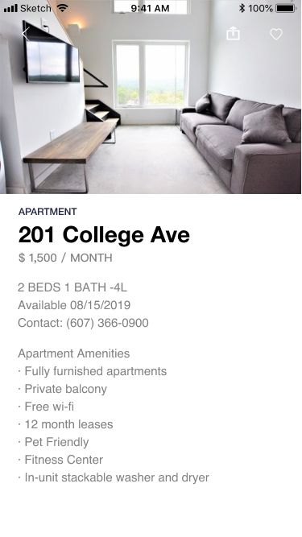
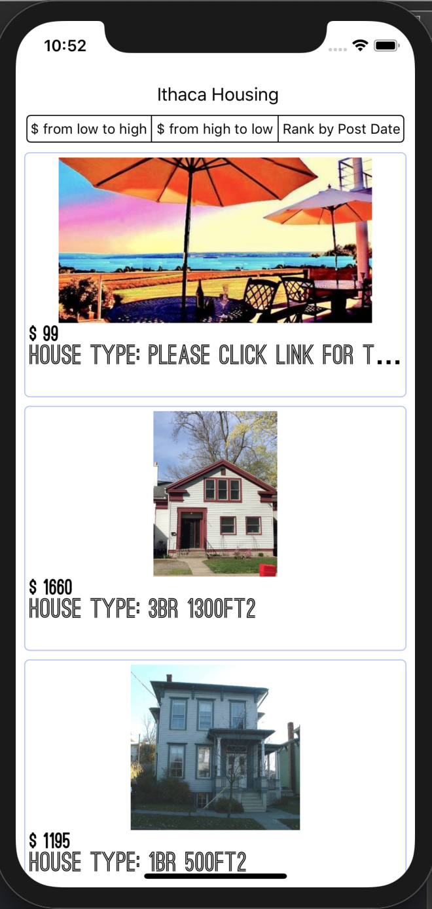
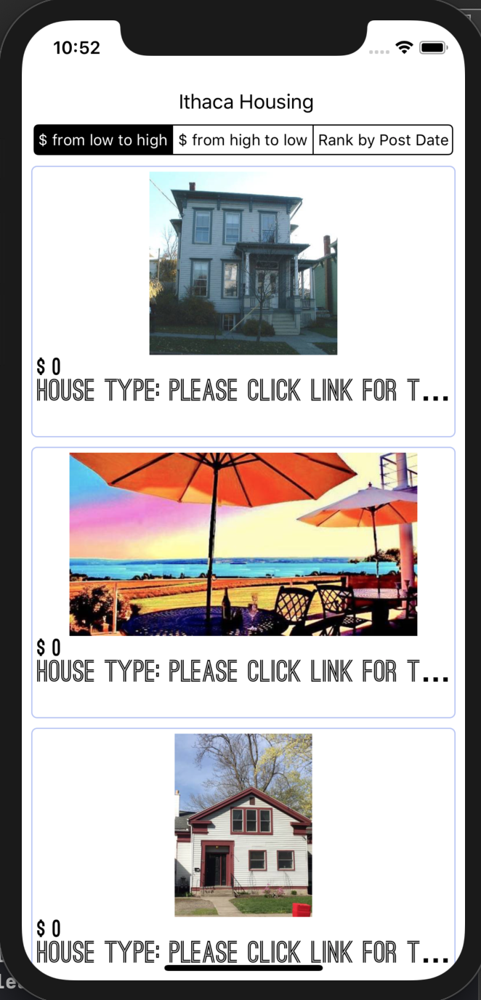
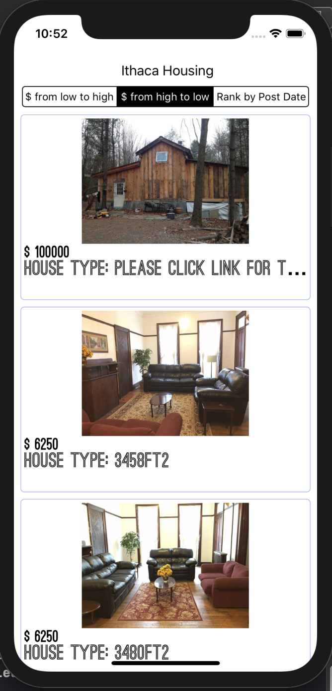
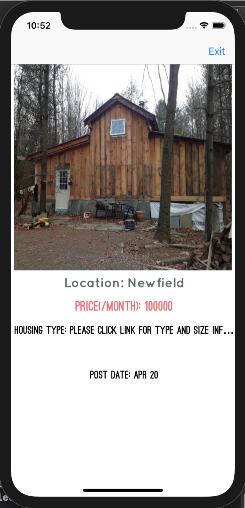

# ithaca_housing_ios

_App Name_: Ithaca Housing

_App Tagline_: Help students to find local housing options around Ithaca

_Link(s) to any other public GitHub repo(s) of your app_: Only one GitHub repo

_Some screenshots of your app (highlight important features):_

**The following pictures are our designed sketch**

**The following pictures are the actual application pages**

_A short description of your app (its purpose and features):_ Users can use this app to looking for houses around ithaca - we collect the housing sources from craigslist and other online websites. Users can view the houses in four different rankings - normal (default) ranking, ranking from low price to high price, ranking from high price to low price, and also ranking by the post date. By clicking into the house detail page, they can see more detailed information about the house.

_A list of how your app addresses each of the requirements (iOS / Backend):_

**iOS**
- AutoLayout using NSLayoutConstraint or SnapKit: Satisfied, used NSLayoutConstraint for all components
- At least one UICollectionView or UITableView: Satisfied, used UICollectionView for housingCollectionView
- Some form of navigation (UINavigationController or UITabBarController) to navigate between screens: Satisfied, used UINavigationController
- Integration with an API - this API must provide some meaningful value to your app. For example, if you’re creating a music app, you could use the Apple Music API. Most of you will integrate with an API written by students in the backend course.: Satisfied, collborated with backend students.

**Backend**

_Anything else you want your grader to know:_ Nothing

Note: The link, screenshots, and description will be used for the Hack Challenge website where we will showcase everyone’s final projects
